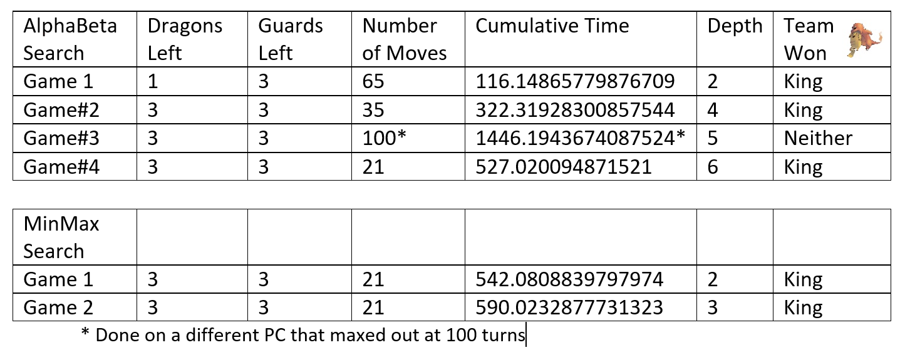

# The Mad King
Assignment 2 for AI 

Before continuing, please read the [game rules](https://github.com/LucrativeHippo/the-mad-king/blob/master/Game%20Rules.md) for a better understanding of the design.

Read [Problem Solution Ideas](https://github.com/LucrativeHippo/the-mad-king/blob/master/Problem%20Solution%20Ideas.txt) for our proposed approaches.

GameBoard:
> [Testing](https://github.com/LucrativeHippo/the-mad-king/blob/master/Initial%20Board%20Test%20Results) different data types for storing the board

First we determined the most efficient way to store variables, unsurprisingly in Python it is dictionaries.
From here we determined an efficient method of determing if we were in an end state:
- less than three dragons and at least one guard
- king in last row
- king surrounded by at least three dragons and can't move

After we have produced a fairly efficient search we move onto creating commands to move pieces. We then developed a MiniMax Search which we tested on a smaller solvable board, without a depth limit. Once we were assured of its ability we moved on to adapt it to having a depth limit and then returning the estimated value of a board at non-terminal states. After some testing we added AlphaBeta pruning to reduce the number of paths we searched down.

